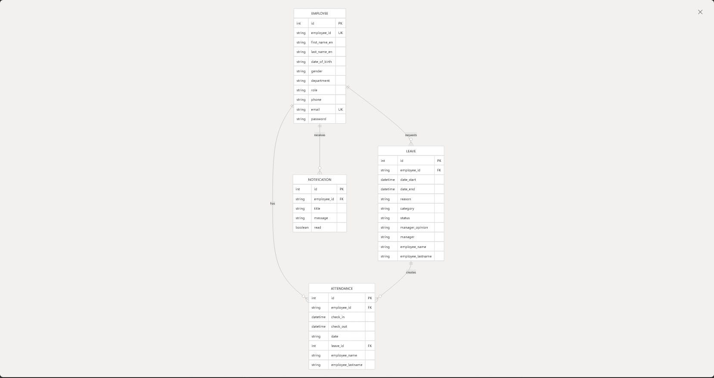

# Employee Management

The Employee Management System is a comprehensive web application for managing employees, tracking attendance (check-in/check-out), processing leave requests, and delivering notifications. It uses a microservices architecture built with Go backend services and a Next.js frontend.

This document provides a technical overview of the system architecture, components, and key workflows. For more detailed information on specific aspects:

## System Architecture

### High-Level Architecture Overview

The Employee Management System is built using a microservices architecture with four primary backend services, each functioning independently and communicating through REST APIs and a message queue.

### Microservices Architecture

Each backend service follows a clean architecture pattern with layered components:

## Database Models

The system uses PostgreSQL with separate schemas for each service domain but interconnected through database links and shared keys:

## Key Workflows

### Attendance Process Flow

The attendance tracking functionality allows employees to check in and out while recording their work hours.

### Leave Request Flow

The leave management system handles the entire process from submission to approval or rejection.

## Containerization and Deployment

The system is containerized using Docker with each service running in its own container. Docker Compose orchestrates the entire deployment:

## Technology Stack

|Component|Technology|Details|
|---|---|---|
|Backend Services|Go (1.22.3)|Fiber web framework, GORM ORM, JWT authentication|
|Frontend|Next.js|React-based with server-side rendering|
|Database|PostgreSQL|Multiple schemas with cross-schema references|
|Message Queue|RabbitMQ|Asynchronous communication between services|
|Containerization|Docker|Docker Compose for orchestration|

## Communication Patterns

The system employs two primary communication patterns:

1. **Synchronous REST APIs**: Direct HTTP interactions between frontend and backend services, and between backend services when immediate responses are required.
    
2. **Asynchronous Messaging**: RabbitMQ handles event-driven communication between services, ensuring eventual consistency and reliable delivery of events.

## Getting Started

To run the system locally:

1. Clone the repository
2. Run `docker-compose up` at the root directory to start backend services and database
3. Navigate to `frontend/employee-management` and run `npm run dev` to start the frontend
4. Access the application at `localhost:3000`

Default user credentials:

- Admin: ID `ADMIN`, Password `123456`
- Employee: ID `EMP0000`, Password `123456`

For database administration, pgAdmin is available at `localhost:5050`:

- Email: `admin@admin.com`
- Password: `root`

For more information about this repository, please 
